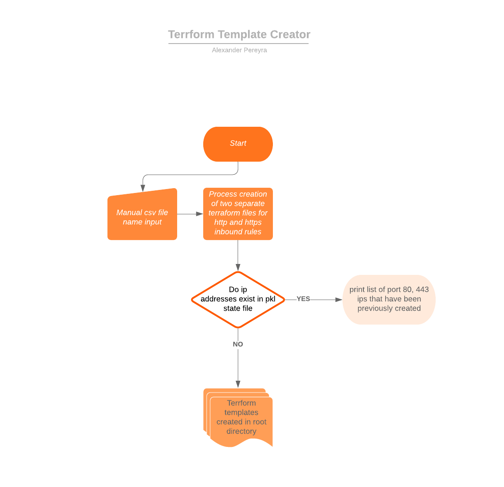

# terraform-template-creator

Python script uses to create terraform templates. In this particular use case, there was a need to read a list of ip addresses from cvs files and create inbound security group rules for them. Python is used to read and parse information needed and creates a terraform template that can used to deploy them.



## Features

- This script will create a 'existing_sg_dict.pkl' in the local directory that will ingest all rules processed to avoid writing duplicates.

### Prerequisites

- python 3 and panda package
- Baseline terraform templates for http and https protocols which are supplied when cloning this repo.

#### How to use

- clone this repo
```
git clone https://github.com/alexpereyra/terraform-template-creator
```

- copy over cvs file to root directory of cloned repo
- run script and input name of csv file that was copied over.
- Creates 'create_sg_http.tf' and 'create_sg_https.tf' files that rules are written to.
